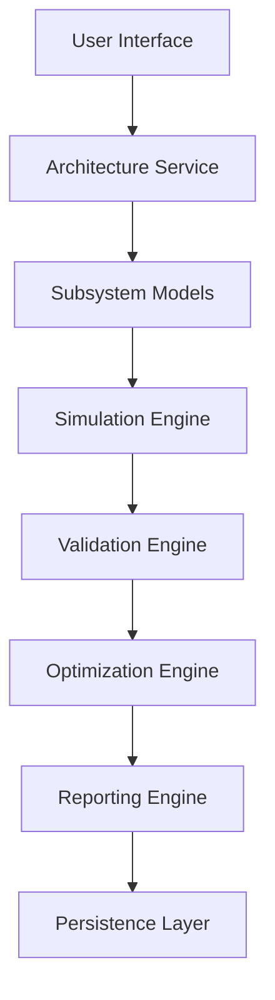
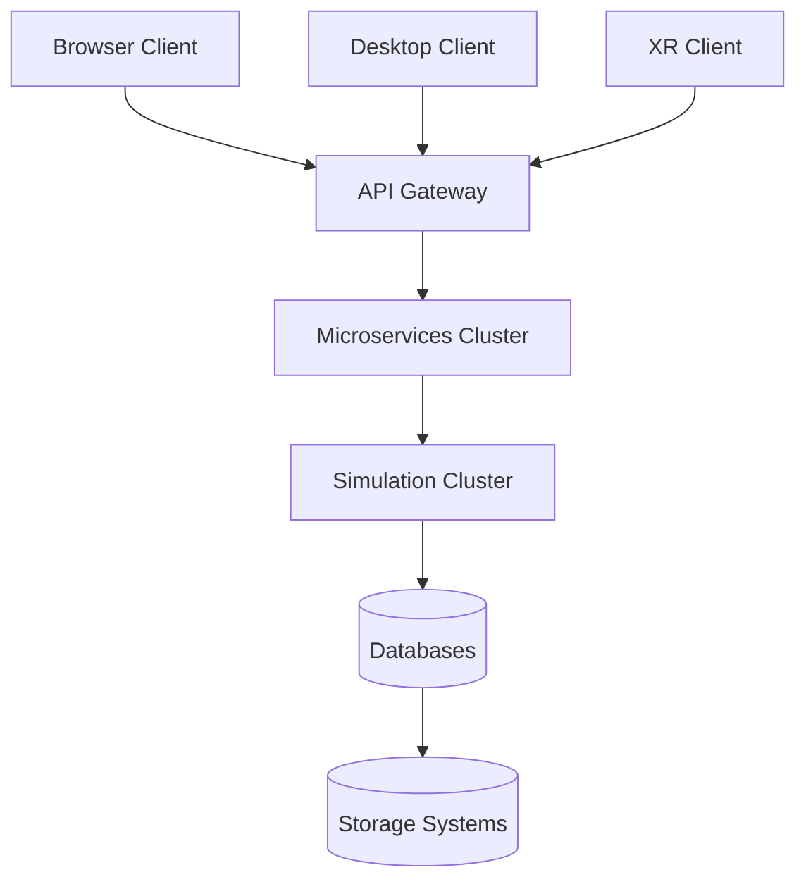

# Satellite Architecture Design Suite — System Architecture

**Document ID:** SADS-ARC-001
**Revision:** 1.0
**Classification:** Engineering Reference

---

## 1. Purpose

This document defines the complete system architecture of the Satellite Architecture Design Suite (SADS). It is the authoritative source for module decomposition, inter-service communication, data flow, and deployment topology.

SADS is a **Model-Based Spacecraft Engineering Platform** unifying capabilities traditionally distributed across CAD software, MBSE tools, simulation environments, and mission analysis systems.

---

## 2. Architectural Goals

### 2.1 Primary Goals

| Goal | Description |
|------|-------------|
| Visual Satellite Architecture Design | Figma-grade canvas for spacecraft systems |
| Subsystem Engineering | First-class models for all 7 satellite subsystems |
| Physics-Based Simulation | Numerical solvers grounded in validated physics |
| Digital Twin Generation | Exportable, telemetry-synced engineering twins |
| Mission Planning | LEO, MEO, GEO, lunar, Mars, deep-space trajectories |
| Design Optimization | Multi-objective trade studies and Pareto analysis |
| Engineering Validation | V&V pipeline with closed-form and numerical checks |

### 2.2 Non-Functional Goals

| Attribute | Target |
|-----------|--------|
| Scalability | 10,000+ components per project |
| Modularity | Engine independence, plug-in architecture |
| Cloud-Native | Containerized microservices |
| Cross-Platform | Web, desktop, XR (Quest/Vision Pro/HoloLens) |
| Extensibility | Plugin SDK for custom engines and components |
| Simulation-Driven | Every design element is immediately simulatable |
| Real-Time Collaboration | CRDT-based multi-user editing |
| Performance | <16ms frame time for 10⁴ components |

---

## 3. System Layers

The platform is decomposed into **five logical layers**, each isolated by well-defined interfaces.

### 3.1 Layer Diagram

```
┌──────────────────────────────────────────────────────────────┐
│  LAYER 5: PRESENTATION                                        │
│  Web · Desktop · XR · 3D · Canvas                            │
└──────────────────────────────────────────────────────────────┘
                            ↕ HTTPS / WSS
┌──────────────────────────────────────────────────────────────┐
│  LAYER 4: APPLICATION                                         │
│  Architecture · Project · Simulation · Twin · Optimize · AI  │
└──────────────────────────────────────────────────────────────┘
                            ↕ gRPC / REST
┌──────────────────────────────────────────────────────────────┐
│  LAYER 3: ENGINEERING                                         │
│  Power · Thermal · Comms · Propulsion · ADCS · Orbit · Struc │
└──────────────────────────────────────────────────────────────┘
                            ↕ SQL / Object Store
┌──────────────────────────────────────────────────────────────┐
│  LAYER 2: DATA                                                │
│  Projects · Components · Satellites · Missions · Results     │
└──────────────────────────────────────────────────────────────┘
                            ↕ OS / Hardware
┌──────────────────────────────────────────────────────────────┐
│  LAYER 1: INFRASTRUCTURE                                      │
│  Docker · Kubernetes · GPU · Object Storage · Message Bus     │
└──────────────────────────────────────────────────────────────┘
```

### 3.2 Layer Responsibilities

#### L5 — Presentation Layer
- Visualization (2D canvas, 3D viewer, orbit viewer)
- User interaction (drag-drop, connect, configure)
- Report rendering and export
- XR scene management

#### L4 — Application Layer
- Workflow orchestration
- Project lifecycle management
- Model execution coordination
- Validation pipeline scheduling
- Optimization driver
- AI Copilot orchestration

#### L3 — Engineering Layer
- Pure-function physics calculations
- Deterministic numerical solvers
- Engineering budget generation
- Trade study math (Pareto, sensitivity)

#### L2 — Data Layer
- Project persistence (PostgreSQL)
- Object storage for geometry (S3-compatible)
- Time-series telemetry (TimescaleDB)
- Versioned component library
- Audit trail / traceability

#### L1 — Infrastructure Layer
- Container orchestration
- Message brokers (NATS / Kafka)
- GPU pools for visualization and ML
- Object storage, caching (Redis)
- Observability (Prometheus, OpenTelemetry)

---

## 4. Service Architecture

### 4.1 Request Flow



### 4.2 Service Inventory

| Service | Purpose | Tech |
|---------|---------|------|
| `architecture-service` | Design CRUD, canvas diff/merge, export | FastAPI, CRDT |
| `project-service` | Projects, missions, baselines, version control | FastAPI, PostgreSQL |
| `simulation-service` | Orchestrates engineering engines | FastAPI, Celery, NumPy/SciPy |
| `digital-twin-service` | Twin generation, telemetry sync | FastAPI, gRPC, MQTT |
| `optimization-service` | DOE, optimization drivers | FastAPI, OpenMDAO |
| `ai-copilot-service` | LLM orchestration, RAG over engineering docs | FastAPI, LangChain, pgvector |
| `reporting-service` | PDF/HTML/JSON report generation | FastAPI, ReportLab, Jinja2 |
| `xr-service` | XR scene streaming, gesture/voice | FastAPI, WebXR |

---

## 5. Core Subsystems

### 5.1 Power Subsystem
- **Functions:** Solar generation, battery storage, distribution, eclipse analysis
- **Outputs:** Power budget, battery DoD margin, lifetime estimation, end-of-life power
- **Models:** Solar array (degradation curve), Li-ion battery (Peukert, DoD), bus regulator
- **Engine:** `engines/power_engine.py`

### 5.2 Thermal Subsystem
- **Functions:** Radiation, conduction, convection, heater/radiator sizing
- **Outputs:** Steady-state & transient temperature maps, thermal margins
- **Models:** Stefan-Boltzmann, Fourier, nodal network
- **Engine:** `engines/thermal_engine.py`

### 5.3 Communications Subsystem
- **Functions:** Link budget, antenna gain, data throughput, BER estimation
- **Outputs:** SNR, BER, link margin, coverage polygons
- **Models:** Free-space path loss, antenna gain, noise temperature
- **Engine:** `engines/comm_engine.py`

### 5.4 Propulsion Subsystem
- **Functions:** ΔV analysis, fuel estimation, maneuver sequencing
- **Outputs:** Propellant budget, burn time, mass fraction
- **Models:** Tsiolkovsky, multi-thruster systems, electric propulsion
- **Engine:** `engines/propulsion_engine.py`

### 5.5 ADCS Subsystem
- **Functions:** Pointing budget, control torque, momentum management
- **Outputs:** Pointing accuracy, stability, slew capability
- **Models:** Rigid-body dynamics, reaction wheels, magnetorquers
- **Engine:** `engines/adcs_engine.py`

### 5.6 Orbit Subsystem
- **Functions:** Keplerian propagation, transfers, ground track, eclipse windows
- **Outputs:** Orbital elements, period, eclipse duration, coverage
- **Models:** Two-body Kepler, J2 perturbation, Hohmann, Lambert
- **Engine:** `engines/orbit_engine.py`

### 5.7 Structural Subsystem (Phase 2)
- **Functions:** Modal analysis, mass distribution, deployment dynamics
- **Outputs:** Natural frequencies, deflection, factor of safety
- **Models:** Finite element, beam/shell, joint stiffness

---

## 6. Deployment Architecture



### 6.1 Scaling Strategy

- **Stateless services** scale horizontally via Kubernetes HPA
- **Simulation workers** scale on queue depth
- **Read replicas** for component library
- **CDN** for static assets and 3D model thumbnails

---

## 7. Technology Stack

| Domain | Technology |
|--------|-----------|
| Frontend | React 18, TypeScript, Vite, Three.js, CesiumJS, React Three Fiber |
| Backend (Primary) | Python 3.11+, FastAPI, Pydantic v2, async/await |
| Backend (Compute) | C++17, Eigen, pybind11, Rust (future) |
| Numerical | NumPy, SciPy, Numba, OpenMDAO, CasADi |
| ML / AI | PyTorch, LangChain, pgvector, Hugging Face |
| Databases | PostgreSQL 15, TimescaleDB, Redis, MinIO |
| Messaging | NATS / Kafka, MQTT (telemetry) |
| Infrastructure | Docker, Kubernetes, Helm, Terraform |
| Observability | OpenTelemetry, Prometheus, Grafana, Loki |
| CI/CD | GitHub Actions, ArgoCD, Trivy, Snyk |

---

## 8. Security Architecture

- **Auth:** OAuth 2.0 / OIDC (Keycloak)
- **AuthZ:** RBAC + ABAC for projects and subsystems
- **Transport:** TLS 1.3, mTLS between services
- **At Rest:** AES-256 encryption (PostgreSQL pgcrypto, S3 SSE-KMS)
- **Secrets:** HashiCorp Vault
- **Audit:** Immutable audit log of all design changes
- **Supply Chain:** Signed container images, SBOM, SLSA L3

---

## 9. Long-Term Vision

SADS targets becoming the **aerospace industry's standard platform** for spacecraft architecture design, subsystem engineering, digital twins, and mission simulation — equivalent in domain impact to:

- **Figma** for design collaboration
- **GitHub** for version control
- **MATLAB/Simulink** for engineering
- **STK** for mission analysis
- **SolidWorks** for mechanical design

…unified into a single, simulation-driven, web-native, AI-augmented platform.

---

## 10. References

- ECSS-E-ST-10C — System engineering general requirements
- ECSS-E-ST-20C — Electrical and electronic
- ECSS-E-ST-31C — Thermal control
- ECSS-E-ST-33C — Propulsion
- ECSS-E-ST-60C — Control engineering
- NASA-STD-7009 — Standard for models and simulations
- ISO 23247 — Digital twin framework for manufacturing
