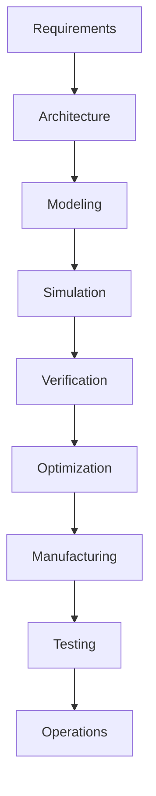
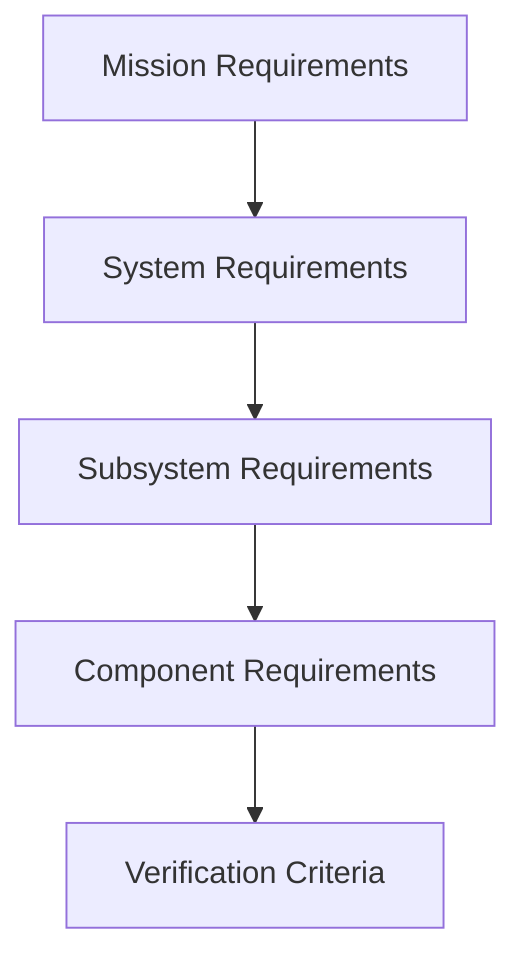

# SADS — Engineering Principles & Design Philosophy

**Document ID:** SADS-ENG-001
**Revision:** 1.0
**Classification:** Engineering Standard

---

## 1. Purpose

This document defines the engineering principles, systems engineering methodologies, design rules, verification standards, and development practices governing the Satellite Architecture Design Suite (SADS).

These principles ensure that every spacecraft architecture generated by the platform is:
* Physically feasible
* Mathematically valid
* Engineering compliant
* Manufacturable
* Testable
* Maintainable
* Mission-capable

---

## 2. Engineering Philosophy

### 2.1 Design Before Manufacturing
Every spacecraft must exist as a fully validated digital system before physical realization. Hardware committing is only permitted after virtual closure of all core subsystem budgets.

---

## 3. Core Systems Engineering Principles

### Principle 1: Systems Thinking
A spacecraft is treated as an integrated system rather than a collection of independent components. Every subsystem interaction must be actively modeled:
* **EPS ↔ Thermal:** Battery performance and charge capacity degrade at thermal extremes; solar panels experience thermal efficiency drops.
* **Propulsion ↔ ADCS:** Fuel slosh and center-of-mass shifts alter the spacecraft's moments of inertia, directly impacting attitude control gains.
* **Payload ↔ Comm:** High data collection rates require corresponding telemetry transmitter downlinks.

> [!IMPORTANT]
> **Engineering Rule:** No subsystem shall be analyzed in isolation.

### Principle 2: Requirement-Driven Engineering
All spacecraft layouts must trace directly back to high-level mission constraints.

### Principle 3: Model-Based Engineering (MBSE)
Models serve as the primary engineering artifact. Code representations, CAD mockups, and documentation are dynamically derived from a single unified systems diagram.

### Principle 4: Digital Twin First
Every spacecraft configuration automatically generates a functional digital twin. The twin contains geometry, mass properties, thermal networks, and reliability profiles that stay linked with the physical satellite telemetry through pre-launch testing and orbital operations.

### Principle 5: Simulation Before Commitment
No layout change or component swap is baselined without first executing the verification simulation pipeline.

---

## 4. Subsystem Engineering Standards

### 4.1 Mass Management
Mass is the primary cost-limiting resource in aerospace engineering. SADS enforces strict tracking of mass parameters:
* **Dry Mass:** Structural bus, empty tanks, cabling, and components.
* **Wet Mass:** Dry mass plus fully loaded propellant mass.
* **Margins Policy:**

| Project Phase | Minimum Mass Margin |
|:---|:---|
| Concept/Initial Design | $30\%$ |
| Preliminary Design Review (PDR) | $20\%$ |
| Critical Design Review (CDR) | $10\%$ |
| Pre-Shipment | $5\%$ |

### 4.2 Electrical Power Management
Power systems must satisfy energy conservation criteria over every orbital period:

$$\int_0^{T_{orbit}} P_{\text{generated}}(t) \, dt \ge \int_0^{T_{orbit}} P_{\text{load}}(t) \, dt$$

All EPS designs must size solar array generation and battery storage margins to handle peak payloads, transmitter duty cycles, and eclipse survival under maximum battery degradation.

### 4.3 Thermal Management
spacecraft temperatures must remain within allowable limits across extreme environmental boundaries.
* **Hot Case:** Maximum solar constant, maximum Earth albedo/IR, and peak payload operations.
* **Cold Case:** Minimum solar constant, eclipse shadow, and minimum standby payload dissipation.

### 4.4 Reliability & Fault Tolerance
* Spacecraft are designed for zero-maintenance operations.
* Architectures require component redundancy for critical paths (e.g. dual-string transceivers, redundant attitude sensors, cross-strapped power buses).
* Platform checks verify graceful degradation paths and safe-mode power budget survival.

---

## 5. Discipline-Specific Engineering Standards

### 5.1 Mechanical & Structural Engineering
* Structures must withstand launch vibration profiles, acoustic pressure levels, and thermal expansion cycles.
* SADS structural checks verify safety margins using defined aerospace thresholds:
  $$\text{Margin of Safety (MS)} = \frac{\sigma_{\text{allowable}}}{\sigma_{\text{actual}} \cdot \text{FoS}} - 1 \ge 0.0$$

### 5.2 Electrical Engineering
* Power distribution wiring must incorporate overcurrent protection, voltage regulators, and electromagnetic isolation.
* EMI/EMC analysis tools verify that radio transceivers, processors, and magnetorquers do not introduce signal interference on adjacent cables.

### 5.3 Communication Engineering
* All telemetry links must maintain link closure margins $\ge 3.0\text{ dB}$:
  $$\text{Margin}_{\text{link}} = \text{EIRP} + G_{\text{receiver}} - L_{\text{path}} - L_{\text{system}} - N_{\text{noise}} \ge 3.0\text{ dB}$$

### 5.4 Propulsion Engineering
* Maneuver sequences must conserve fuel and respect dry/wet center of mass offsets during delta-V operations.

### 5.5 ADCS Engineering
* Pointing accuracy budgets compile star tracker noise, gyroscope drift, and wheel torque noise using root-sum-square (RSS) covariance calculations.

---

## 6. Software & Numerical Engineering Rules

* **Separation of Concerns:** Keep presentation (UI) modules completely separated from the physics solvers and DB layers.
* **Numerical Stability:** Iterative mathematical methods (e.g. Newton-Raphson solvers for thermal equations) must prove convergence boundaries and include error estimations for each solved node.
