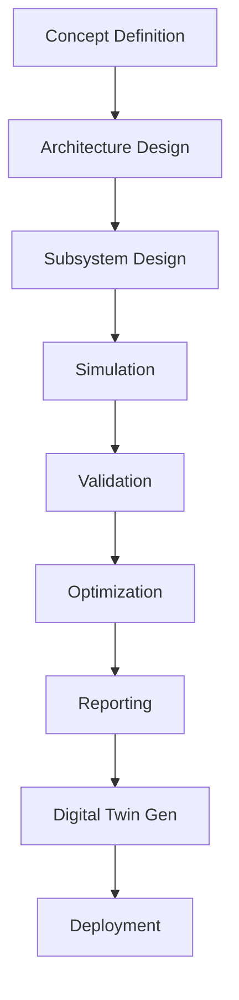
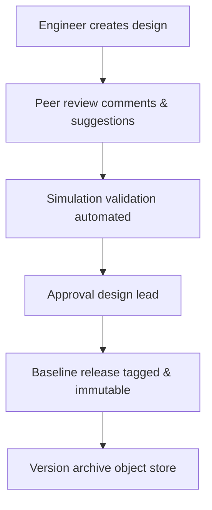
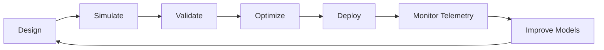

# SADS — Workflow Document

**Document ID:** SADS-WFL-001
**Revision:** 1.0

---

## 1. Project Lifecycle

---

## 2. Design Workflow

### Step 1 — Create Mission

Define the operational context:
- Orbit (LEO/MEO/GEO/Lunar/Mars/Deep Space)
- Mission objectives (Earth obs, comms, science, tech demo)
- Mission duration
- Payload requirements
- Constraints (mass, volume, cost, schedule)

### Step 2 — Create Satellite Architecture

Open the canvas and add subsystem containers:
- Power
- Thermal
- Communications
- Propulsion
- ADCS
- Payload
- Structure (Phase 2)

### Step 3 — Configure Components

For each component, specify:
- Mass, dimensions, center of gravity
- Electrical parameters (V, I, P, duty cycle)
- Thermal parameters (heat dissipation, operating range)
- Interface definitions (ports)
- Reliability (MTBF, redundancy)

### Step 4 — Run Simulations

| Simulation | Engine | Inputs | Outputs |
|-----------|--------|--------|---------|
| Power | PowerEngine | Array, battery, load, orbit | Power budget, eclipse margin |
| Thermal | ThermalEngine | Heat loads, surfaces, env | Temperature map, margins |
| Communications | CommEngine | Antenna, TX, distance | SNR, BER, link margin |
| Propulsion | PropulsionEngine | Thrusters, maneuvers, mass | ΔV, propellant, burn time |
| ADCS | ADCSEngine | Inertia, wheels, sensors | Pointing, momentum |
| Orbit | OrbitEngine | Elements, epoch | Trajectory, coverage, eclipse |

### Step 5 — Validation

Automated V&V rules:
- **Power closure:** Generation ≥ Load in all phases
- **Thermal closure:** All components within qualified range
- **Mass limits:** Total mass within launcher capacity
- **ΔV adequacy:** Available ΔV ≥ Required ΔV × 1.1 (10% margin)
- **Link closure:** Link margin ≥ 3 dB
- **Pointing:** Achieved pointing ≤ Required pointing
- **Stability:** Natural frequencies ≥ 10× controller bandwidth

### Step 6 — Optimization

Multi-objective trade studies:
- **Minimize mass** subject to all constraints
- **Minimize cost** subject to performance
- **Maximize reliability** subject to mass limit
- **Maximize mission duration** subject to ΔV budget

Methods: DOE (Latin hypercube), gradient (SLSQP), genetic (NSGA-II), Bayesian.

### Step 7 — Generate Reports

Outputs:
- **Engineering Report** (PDF) — design summary, budgets, simulation results
- **Compliance Report** — ECSS / NASA-STD checklist
- **Simulation Report** — input decks, output plots, convergence
- **Interface Control Document** — port-by-port ICD
- **Digital Twin Manifest** — assets, sync configuration

### Step 8 — Generate Digital Twin

Produces three coupled artifacts:
- **Engineering Twin** — full design state (JSON + binary)
- **Simulation Twin** — pre-compiled numerical model
- **Operational Twin** — telemetry bindings, anomaly thresholds

---

## 3. Collaboration Workflow

Multi-user editing uses CRDT for conflict-free merges. Comments are first-class objects with status (open / resolved / wontfix).

---

## 4. Continuous Engineering Workflow

For operational satellites, SADS supports a closed-loop engineering process:

The **Monitor** stage ingests live telemetry, the **Improve** stage surfaces design-vs-flight deltas and proposes model updates, closing the digital-twin loop.

---

## 5. Mission Phase Workflow

| Phase | Duration (typical) | SADS Activities |
|-------|-------------------|-----------------|
| Concept | Weeks | Parametric trades, mission feasibility |
| Design | Months | Detailed architecture, PDR/CDR |
| Manufacture | Months | As-built updates, factory acceptance |
| Integration | Months | Test correlation, model calibration |
| Operations | Years | Digital twin monitoring, anomaly response |
| End-of-Life | Days–Weeks | Deorbit analysis, final report |

---

## 6. Approval Gates

| Gate | Required Artifacts | Reviewers |
|------|-------------------|-----------|
| **PDR** (Preliminary Design Review) | Mission def, architecture, mass/power/ΔV budgets, initial sims | Systems + Mission + Program |
| **CDR** (Critical Design Review) | Detailed designs, V&V reports, ICDs, margins | All subsystem leads |
| **FRR** (Flight Readiness Review) | As-built twin, test reports, operational procedures | Program + Operations + Safety |
| **ORR** (Operational Readiness Review) | Commissioning plan, contingency plans | Operations + Customer |

SADS automatically generates the artifact bundles for each gate from the current design state.
