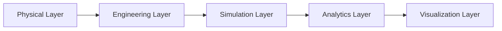

# SADS — Design Document

**Document ID:** SADS-DSN-001
**Revision:** 1.0

---

## 1. Design Philosophy

SADS follows a **Digital Engineering First** approach. Every design element in the system must be:

| Principle | Implementation |
|-----------|---------------|
| **Visual** | SVG/Canvas with real-time rendering |
| **Traceable** | Every component links to source, version, author |
| **Simulatable** | One-click run against any registered engine |
| **Verifiable** | Outputs cross-checked against V&V rules |

The system models reality as a **directed graph of components and connections**, with simulation as a function applied to the graph.

---

## 2. User Roles

| Role | Primary Activities |
|------|-------------------|
| **Systems Engineer** | Designs complete architectures, runs trade studies |
| **Power Engineer** | Sizes arrays/batteries, validates energy balance |
| **Thermal Engineer** | Performs thermal analysis, sizes radiators |
| **Propulsion Engineer** | Computes ΔV budgets, selects thrusters |
| **Comms Engineer** | Closes link budgets, plans coverage |
| **ADCS Engineer** | Sizes wheels/torquers, validates pointing |
| **Mission Analyst** | Designs trajectories, simulates mission |
| **AI Assistant** | Recommends, reviews, optimizes, flags risks |

---

## 3. Design Environment

### 3.1 Infinite Engineering Canvas

A Figma-class infinite zoomable canvas with:

- **Drag-and-drop** component placement
- **Layers** for hierarchical organization (satellite → subsystem → component)
- **Smart connections** (power, data, thermal, mechanical) with auto-routing
- **Templates** for common spacecraft classes (CubeSat, ESPA-class, GEO bus)
- **Real-time multi-user collaboration** via CRDT (Yjs / Automerge)
- **Version control** with branching, diff visualization, baseline tagging

### 3.2 Component Model

Each component is a typed object with the following schema:

```typescript
interface Component {
  id: UUID;
  type: ComponentType;            // e.g. "solar_panel", "thruster"
  metadata: {
    name: string;
    description: string;
    manufacturer: string;
    partNumber: string;
    datasheetRef: string;
  };
  position: { x: number; y: number; z: number };
  rotation: Quaternion;
  engineering: {
    mass_kg: number;
    volume_m3: number;
    power_w: number;              // steady-state dissipation
    thermal: { ... };
    reliability: { mtbf_h: number };
  };
  simulation: {
    model: string;                // python module path
    inputs: Port[];
    outputs: Port[];
    constraints: Constraint[];
  };
  visual: {
    geometry: string;             // GLB/GLTF reference
    color: string;
    icon: string;
  };
}
```

### 3.3 Connection Model

```typescript
interface Connection {
  id: UUID;
  from: Port;
  to: Port;
  type: "power" | "data" | "thermal" | "mechanical" | "fluid";
  properties: { ... };           // voltage, baud rate, flow rate, etc.
}
```

---

## 4. Visualization Design

### 4.1 2D Architecture View

- **Purpose:** System architecture planning
- **Displays:** Components as nodes, connections as typed lines
- **Overlays:** Power flow heatmap, data flow animation, thermal gradient
- **Interactions:** Pan, zoom, multi-select, group, align, distribute

### 4.2 3D Engineering View

- **Purpose:** Physical representation
- **Displays:** Geometry, internal layout, harness routing, thermal zones
- **Features:** Rotate, explode, cross-section, transparency, measurement
- **Tech:** Three.js + React Three Fiber

### 4.3 Orbit View

- **Purpose:** Mission visualization
- **Displays:** Ground tracks, coverage, maneuvers, eclipse, sun vector
- **Features:** Time scrubber, scale toggle (LEO ↔ GEO), mission timeline
- **Tech:** CesiumJS

### 4.4 XR View

- **Purpose:** Immersive review
- **Displays:** 1:1 scale satellite model in environment
- **Features:** Walk around, inspect subsystems, exploded view
- **Tech:** WebXR API, optimized GLB/GLTF

---

## 5. Design Principles

### Principle 1 — Single Source of Truth

Every subsystem and component references **one shared engineering model**. Changes propagate through the dependency graph automatically. No duplicate state.

### Principle 2 — Simulation First

Any design element is immediately simulatable. Users see results within seconds. No "compile" or "build" step.

### Principle 3 — Physics Validity

All outputs originate from **validated engineering models** with explicit assumptions, units, and uncertainty bounds. Black-box calculators are forbidden in the engineering layer.

### Principle 4 — Traceability

Every result is traceable to:
- The source design state (commit hash)
- The simulation that produced it
- The validation rules applied
- The engineer responsible

### Principle 5 — Progressive Disclosure

Beginners see a clean canvas. Experts get raw numbers, equations, and solver diagnostics. The UI never hides the physics.

### Principle 6 — Open by Default

All internal formats are documented. Export to STK, GMAT, OpenMDAO, STEP, OBJ, GLTF, CSV, JSON, HDF5.

---

## 6. Digital Twin Design

The digital twin is a four-layer live synchronization system:



The digital twin remains synchronized with the engineering model throughout the entire project lifecycle — from concept to operations to retirement.

---

## 7. UI/UX Design Language

| Token | Value | Usage |
|-------|-------|-------|
| Primary | `#4fc3f7` | Actions, highlights |
| Background | `#0a0e1a` | App background |
| Surface | `#1a2332` | Panels, cards |
| Border | `#2a3548` | Dividers |
| Text | `#e0e6f0` | Primary text |
| Success | `#a5d6a7` | OK status |
| Warning | `#ffd54f` | Marginal |
| Danger | `#ef5350` | Violation |
| Font | Inter / system-ui | UI |
| Mono | JetBrains Mono | Engineering values |
| Spacing | 4px base | 4/8/12/16/24/32/48 |

Component density: **engineer-grade**. High information density with clear visual hierarchy. Aerospace professionals prefer data over decoration.

---

## 8. Accessibility

- WCAG 2.1 AA compliance
- Full keyboard navigation
- Screen reader support for all canvas components
- High-contrast theme
- Reduced-motion mode
- Color-blind safe palettes for budget status (shape + color)

---

## 9. Internationalization

- All strings externalized (i18n)
- Units toggleable: SI / Imperial (display only — internal storage always SI)
- Date/number formatting per locale
- Initial release: en-US; planned: de-DE, ja-JP, zh-CN
